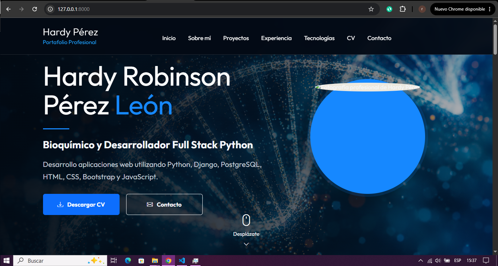

# 🚀 Portafolio Profesional

Portafolio web desarrollado con **Django** para presentar mi perfil profesional, experiencia, proyectos y competencias técnicas como **Bioquímico** y **Desarrollador Full Stack Python en formación**.

---

## 📸 Vista previa



> Reemplaza `preview.png` por una captura de pantalla de la página principal.

---

# 📌 Características

- Diseño moderno y responsivo.
- Sección de presentación profesional.
- Información personal y objetivo profesional.
- Tecnologías utilizadas.
- Proyectos desarrollados.
- Experiencia profesional.
- Visualización del Currículum Vitae en PDF.
- Información de contacto.
- Navegación con desplazamiento suave (Smooth Scroll).

---

# 🛠 Tecnologías utilizadas

### Backend

- Python
- Django
- SQLite

### Frontend

- HTML5
- CSS3
- Bootstrap 5
- JavaScript

### Herramientas

- Git
- GitHub
- Visual Studio Code

---

# 📂 Estructura del proyecto

```
portafolio_profesional/
│
├── config/
├── portfolio/
├── static/
│   ├── css/
│   ├── img/
│   ├── cv/
│   └── js/
│
├── templates/
├── media/
├── manage.py
├── requirements.txt
├── README.md
└── .gitignore
```

---

# ⚙ Instalación

## 1. Clonar el repositorio

```bash
git clone https://github.com/TU-USUARIO/portafolio_profesional.git
```

Entrar al proyecto

```bash
cd portafolio_profesional
```

---

## 2. Crear entorno virtual

Windows

```bash
python -m venv venv
```

Activar

```bash
venv\Scripts\activate
```

---

## 3. Instalar dependencias

```bash
pip install -r requirements.txt
```

---

## 4. Aplicar migraciones

```bash
python manage.py migrate
```

---

## 5. Ejecutar el servidor

```bash
python manage.py runserver
```

Abrir en el navegador

```
http://127.0.0.1:8000/
```

---

# 📄 Funcionalidades

✅ Página de inicio

✅ Sobre mí

✅ Tecnologías

✅ Proyectos

✅ Experiencia

✅ Currículum Vitae

✅ Contacto

---

# 📸 Capturas

## Página principal

Agrega aquí una captura.

---

## Proyectos

Agrega aquí otra captura.

---

## Currículum

Agrega aquí otra captura.

---

# 👨‍💻 Autor

**Hardy Robinson Pérez León**

Bioquímico | Desarrollador Full Stack Python (en formación)

📍 Puerto Varas, Chile

📧 robinson.leonhp@gmail.com

🔗 GitHub

https://github.com/Hardy-Perez-Leon

🔗 LinkedIn

Agrega aquí tu perfil de LinkedIn.

---

# 📜 Licencia

Proyecto desarrollado con fines educativos y de aprendizaje.
